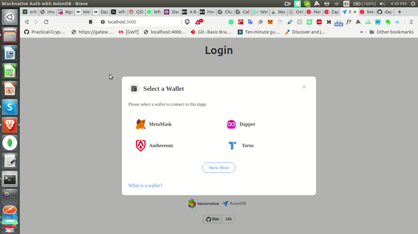

## aviondb-onboard-js

> A Blocknaive's OnBoard.js Auth based Access Controller for AvionDB & OrbitDB

### Demo



### Try it out

Check out the [Todolist in Action](https://bit.ly/aviondb-onboard).

### Requirements

The minimum required version of Node.js is now 8.6.0 due to the usage of `...` spread syntax. LTS versions (even numbered versions 8, 10, etc) are preferred.

### How to Use?

Run the following command to install dependencies & Open the console to see logs

```
npm i
npm start
```

### How it Works?

TODO: Add How it Works
